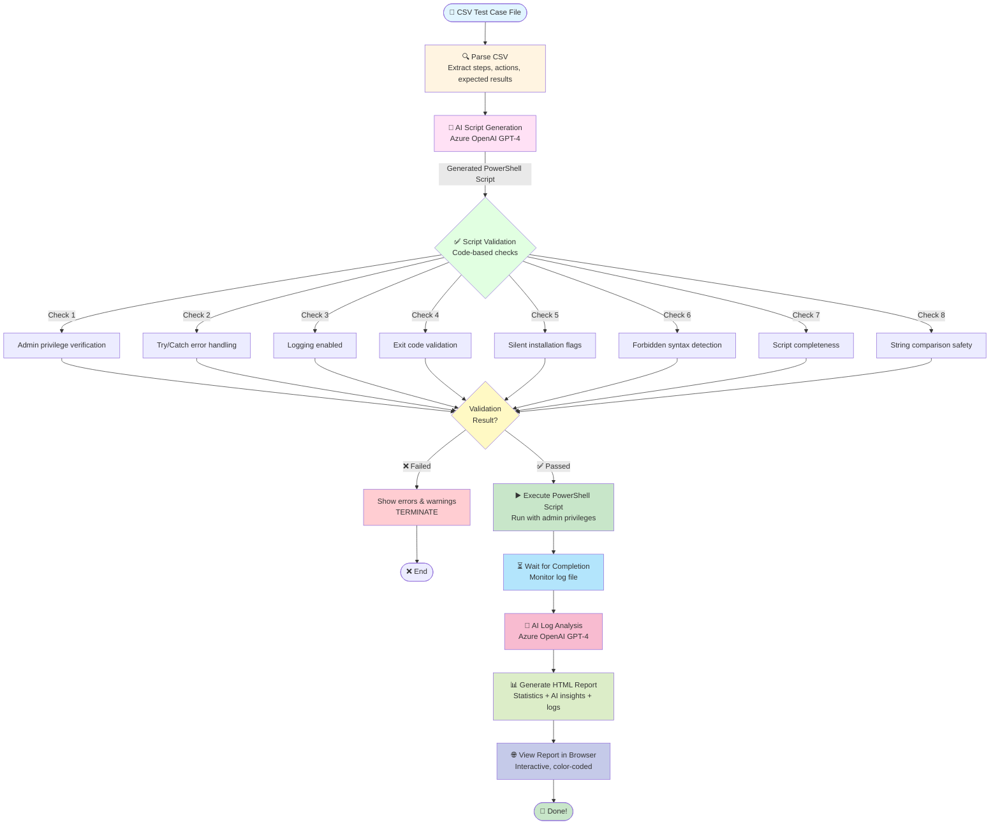

# Auto-Test V2 Workflow Diagram
## Complete End-to-End Process Visualization

---

## 📊 Method 1: ASCII Art Flowchart (Best for Documents)

```
┌─────────────────────────────────────────────────────────────────────┐
│                        📄 CSV Test Case File                        │
│                     (Steps, Actions, Expected Results)              │
└────────────────────────────────┬────────────────────────────────────┘
                                 │
                                 ▼
┌─────────────────────────────────────────────────────────────────────┐
│                         🔍 PARSE CSV                                │
│  • Extract test steps                                               │
│  • Identify test scenario                                           │
│  • Structure test case data                                         │
└────────────────────────────────┬────────────────────────────────────┘
                                 │
                                 ▼
┌─────────────────────────────────────────────────────────────────────┐
│                    🤖 AI SCRIPT GENERATION                          │
│                      (Azure OpenAI GPT-4)                           │
│  ┌───────────────────────────────────────────────────────────────┐ │
│  │ System Prompt: PowerShell automation expert rules            │ │
│  │ User Prompt: Convert {steps} to goal-oriented script         │ │
│  │ Output: 200-300 line PowerShell test script                  │ │
│  └───────────────────────────────────────────────────────────────┘ │
│  • Analyze test scenario & objectives                               │
│  • Map human steps → PowerShell commands                            │
│  • Add error handling & logging                                     │
│  • Generate complete automation script                              │
└────────────────────────────────┬────────────────────────────────────┘
                                 │
                                 ▼
┌─────────────────────────────────────────────────────────────────────┐
│               ✅ SCRIPT VALIDATION (Code-based)                     │
│                    ⚡ Fast • 💰 Free • 🎯 Accurate                  │
│  ┌───────────────────────────────────────────────────────────────┐ │
│  │ ✓ Check 1: Admin privilege verification                      │ │
│  │ ✓ Check 2: Try/Catch error handling blocks                   │ │
│  │ ✓ Check 3: Logging enabled (Start/Stop-Transcript)           │ │
│  │ ✓ Check 4: Exit code validation ($LASTEXITCODE)              │ │
│  │ ✓ Check 5: Silent installation flags (/qn not /qn+)          │ │
│  │ ✓ Check 6: Forbidden syntax (no goto, labels)                │ │
│  │ ✓ Check 7: Script completeness (braces balanced)             │ │
│  │ ✓ Check 8: String comparison safety (.Trim())                │ │
│  └───────────────────────────────────────────────────────────────┘ │
└────────────────────────────────┬────────────────────────────────────┘
                                 │
                    ┌────────────┴────────────┐
                    │   Validation Result?    │
                    └────────────┬────────────┘
                                 │
                ┌────────────────┴────────────────┐
                │                                 │
                ▼                                 ▼
    ┌─────────────────────┐         ┌─────────────────────────┐
    │  ❌ FAILED          │         │  ✅ PASSED              │
    │                     │         │                         │
    │ • Show errors       │         │ • Proceed to execution  │
    │ • Display warnings  │         └───────────┬─────────────┘
    │ • TERMINATE         │                     │
    └─────────────────────┘                     │
                                                ▼
                            ┌─────────────────────────────────────────┐
                            │      ▶️ EXECUTE POWERSHELL SCRIPT       │
                            │                                         │
                            │ • Run with admin privileges             │
                            │ • Capture stdout/stderr                 │
                            │ • Record full transcript log            │
                            │ • Monitor execution status              │
                            └──────────────────┬──────────────────────┘
                                               │
                                               ▼
                            ┌─────────────────────────────────────────┐
                            │       ⏳ WAIT FOR COMPLETION            │
                            │                                         │
                            │ • Monitor log file for completion       │
                            │ • Track progress markers                │
                            │ • Detect early failures                 │
                            │ • Timeout: 300 seconds                  │
                            └──────────────────┬──────────────────────┘
                                               │
                                               ▼
                            ┌─────────────────────────────────────────┐
                            │      🤖 AI LOG ANALYSIS                 │
                            │      (Azure OpenAI GPT-4)               │
                            │  ┌───────────────────────────────────┐ │
                            │  │ System: Expert test analyst       │ │
                            │  │ Input: Full execution logs        │ │
                            │  │ Output: Intelligent analysis      │ │
                            │  └───────────────────────────────────┘ │
                            │ • Analyze overall result (PASS/FAIL)    │
                            │ • Identify failure root causes          │
                            │ • Detect potential issues & warnings    │
                            │ • Provide actionable recommendations    │
                            └──────────────────┬──────────────────────┘
                                               │
                                               ▼
                            ┌─────────────────────────────────────────┐
                            │      📊 GENERATE HTML REPORT            │
                            │                                         │
                            │ • Execution statistics (pass/fail)      │
                            │ • Script validation results             │
                            │ • AI analysis summary                   │
                            │ • Full execution logs                   │
                            │ • Timestamp & metadata                  │
                            └──────────────────┬──────────────────────┘
                                               │
                                               ▼
                            ┌─────────────────────────────────────────┐
                            │      🌐 VIEW REPORT IN BROWSER          │
                            │                                         │
                            │ ✅ Color-coded pass/fail indicators     │
                            │ 📈 Interactive collapsible sections     │
                            │ 🎨 Responsive design (mobile-friendly)  │
                            │ 🔍 Syntax-highlighted logs              │
                            └─────────────────────────────────────────┘
                                               │
                                               ▼
                            ┌─────────────────────────────────────────┐
                            │              🎉 DONE                    │
                            │    Test case automated successfully!    │
                            └─────────────────────────────────────────┘
```

---

## 🎨 Method 2: Mermaid Diagram (Best for GitHub/Markdown)

Copy this into any Markdown viewer or presentation tool that supports Mermaid:



---

## 🖼️ Method 3: Detailed Visual (Best for PowerPoint/Slides)

### **Stage 1: Input & Parsing**
```
┏━━━━━━━━━━━━━━━━━━━━━━━━━━━━━━━━━━━━━━━━━━━┓
┃  INPUT: CSV Test Case                     ┃
┃  ┌──────────────────────────────────────┐ ┃
┃  │ Step | Action | Expected Result     │ ┃
┃  │ 1    | Check file exists | Found    │ ┃
┃  │ 2    | Install MSI | Exit code 0    │ ┃
┃  │ ...  | ...                          │ ┃
┃  └──────────────────────────────────────┘ ┃
┗━━━━━━━━━━━━━━━━━━┳━━━━━━━━━━━━━━━━━━━━━━━┛
                   ▼
┏━━━━━━━━━━━━━━━━━━━━━━━━━━━━━━━━━━━━━━━━━━━┓
┃  PROCESS: Parse CSV                        ┃
┃  Extract: test_case_id, scenario, steps    ┃
┗━━━━━━━━━━━━━━━━━━┳━━━━━━━━━━━━━━━━━━━━━━━┛
                   ▼
```

### **Stage 2: AI Generation**
```
┏━━━━━━━━━━━━━━━━━━━━━━━━━━━━━━━━━━━━━━━━━━━┓
┃  🤖 AI: Script Generation (GPT-4)          ┃
┃  ┌──────────────────────────────────────┐ ┃
┃  │ Prompt Engineering:                  │ ┃
┃  │ • System: PowerShell expert rules    │ ┃
┃  │ • User: Convert {11 steps} to script│ ┃
┃  │ • Temperature: 0.1 (deterministic)   │ ┃
┃  │ • Max tokens: 4000                   │ ┃
┃  └──────────────────────────────────────┘ ┃
┃  ⏱️ Time: ~20-30 seconds                   ┃
┃  💰 Cost: ~$0.02-0.05 per script           ┃
┗━━━━━━━━━━━━━━━━━━┳━━━━━━━━━━━━━━━━━━━━━━━┛
                   ▼
┏━━━━━━━━━━━━━━━━━━━━━━━━━━━━━━━━━━━━━━━━━━━┓
┃  OUTPUT: PowerShell Script (200-300 lines)┃
┃  ┌──────────────────────────────────────┐ ┃
┃  │ # Admin check                        │ ┃
┃  │ # Phase 1: Pre-check                 │ ┃
┃  │ # Phase 2: Installation              │ ┃
┃  │ # Phase 3: Verification              │ ┃
┃  │ # Phase 4: Cleanup                   │ ┃
┃  └──────────────────────────────────────┘ ┃
┗━━━━━━━━━━━━━━━━━━┳━━━━━━━━━━━━━━━━━━━━━━━┛
                   ▼
```

### **Stage 3: Validation (Code-based, NOT AI)**
```
┏━━━━━━━━━━━━━━━━━━━━━━━━━━━━━━━━━━━━━━━━━━━┓
┃  ✅ CODE: Script Validation                ┃
┃  ┌──────────────────────────────────────┐ ┃
┃  │ ✓ 1. Admin check exists?             │ ┃
┃  │ ✓ 2. Try-catch blocks present?       │ ┃
┃  │ ✓ 3. Logging enabled?                │ ┃
┃  │ ✓ 4. Exit code validated?            │ ┃
┃  │ ✓ 5. Silent install (/qn)?           │ ┃
┃  │ ✓ 6. No forbidden syntax (goto)?     │ ┃
┃  │ ✓ 7. Script complete (braces)?       │ ┃
┃  │ ✓ 8. String comparison safe?         │ ┃
┃  └──────────────────────────────────────┘ ┃
┃  ⚡ Time: <100ms (instant)                 ┃
┃  💰 Cost: $0 (free)                        ┃
┃  🎯 Accuracy: 100% (rule-based)            ┃
┗━━━━━━━━━━━━━━━━━━┳━━━━━━━━━━━━━━━━━━━━━━━┛
                   ▼
              ┌─────────┐
              │ Valid?  │
              └────┬────┘
       ┌───────────┴───────────┐
       ▼                       ▼
   ❌ NO                   ✅ YES
   ┌─────────┐           Continue
   │ STOP    │              ▼
   │ Show    │
   │ Errors  │
   └─────────┘
```

### **Stage 4: Execution**
```
┏━━━━━━━━━━━━━━━━━━━━━━━━━━━━━━━━━━━━━━━━━━━┓
┃  ▶️ EXECUTE: PowerShell Script             ┃
┃  ┌──────────────────────────────────────┐ ┃
┃  │ Start-Transcript -Path "log.txt"     │ ┃
┃  │ # Install MSI                        │ ┃
┃  │ # Check service                      │ ┃
┃  │ # Verify logs                        │ ┃
┃  │ Stop-Transcript                      │ ┃
┃  └──────────────────────────────────────┘ ┃
┃  🔐 Elevation: Admin privileges required   ┃
┃  📝 Logging: Full transcript captured      ┃
┗━━━━━━━━━━━━━━━━━━┳━━━━━━━━━━━━━━━━━━━━━━━┛
                   ▼
┏━━━━━━━━━━━━━━━━━━━━━━━━━━━━━━━━━━━━━━━━━━━┓
┃  ⏳ WAIT: Monitor Completion               ┃
┃  Watch log file for completion markers     ┃
┃  Timeout: 300 seconds (5 minutes)          ┃
┗━━━━━━━━━━━━━━━━━━┳━━━━━━━━━━━━━━━━━━━━━━━┛
                   ▼
```

### **Stage 5: AI Analysis**
```
┏━━━━━━━━━━━━━━━━━━━━━━━━━━━━━━━━━━━━━━━━━━━┓
┃  🤖 AI: Log Analysis (GPT-4)               ┃
┃  ┌──────────────────────────────────────┐ ┃
┃  │ INPUT: Execution logs (full text)    │ ┃
┃  │ ┌──────────────────────────────────┐ │ ┃
┃  │ │ [PASS] MSI file found            │ │ ┃
┃  │ │ [PASS] Installation exit code 0  │ │ ┃
┃  │ │ [PASS] Service running           │ │ ┃
┃  │ │ [FAIL] Log entry missing         │ │ ┃
┃  │ └──────────────────────────────────┘ │ ┃
┃  └──────────────────────────────────────┘ ┃
┃  ┌──────────────────────────────────────┐ ┃
┃  │ OUTPUT: Intelligent Analysis         │ ┃
┃  │ ┌──────────────────────────────────┐ │ ┃
┃  │ │ 1. Overall: FAIL (1 check)       │ │ ┃
┃  │ │ 2. Root cause: Agent not started │ │ ┃
┃  │ │ 3. Recommendation: Check startup │ │ ┃
┃  │ └──────────────────────────────────┘ │ ┃
┃  └──────────────────────────────────────┘ ┃
┃  ⏱️ Time: ~10-20 seconds                   ┃
┃  💰 Cost: ~$0.01-0.02 per analysis         ┃
┗━━━━━━━━━━━━━━━━━━┳━━━━━━━━━━━━━━━━━━━━━━━┛
                   ▼
```

### **Stage 6: Reporting**
```
┏━━━━━━━━━━━━━━━━━━━━━━━━━━━━━━━━━━━━━━━━━━━┓
┃  📊 GENERATE: HTML Report                  ┃
┃  ┌──────────────────────────────────────┐ ┃
┃  │ ┌─ Execution Statistics ──────────┐ │ ┃
┃  │ │ Status: FAIL                    │ │ ┃
┃  │ │ Passed: 10/11                   │ │ ┃
┃  │ │ Failed: 1/11                    │ │ ┃
┃  │ └─────────────────────────────────┘ │ ┃
┃  │ ┌─ Validation Results ────────────┐ │ ┃
┃  │ │ ✓ All checks passed             │ │ ┃
┃  │ └─────────────────────────────────┘ │ ┃
┃  │ ┌─ AI Analysis ───────────────────┐ │ ┃
┃  │ │ [Intelligent insights here]     │ │ ┃
┃  │ └─────────────────────────────────┘ │ ┃
┃  │ ┌─ Full Logs ─────────────────────┐ │ ┃
┃  │ │ [Collapsible log details]       │ │ ┃
┃  │ └─────────────────────────────────┘ │ ┃
┃  └──────────────────────────────────────┘ ┃
┗━━━━━━━━━━━━━━━━━━┳━━━━━━━━━━━━━━━━━━━━━━━┛
                   ▼
┏━━━━━━━━━━━━━━━━━━━━━━━━━━━━━━━━━━━━━━━━━━━┓
┃  🌐 VIEW: Interactive Browser Report       ┃
┃  • Color-coded pass/fail indicators        ┃
┃  • Expandable log sections                 ┃
┃  • Responsive design                       ┃
┃  • One-click opening                       ┃
┗━━━━━━━━━━━━━━━━━━━━━━━━━━━━━━━━━━━━━━━━━━━┛
```

---

## 📈 Method 4: Timeline View (Best for Process Overview)

```
TIME  │ STAGE                      │ TECHNOLOGY        │ COST    │ DURATION
══════╪════════════════════════════╪═══════════════════╪═════════╪══════════
00:00 │ 📄 CSV Input               │ File System       │ Free    │ Instant
      │ ↓                          │                   │         │
00:01 │ 🔍 Parse CSV               │ Python (pandas)   │ Free    │ <1s
      │ ↓                          │                   │         │
00:02 │ 🤖 AI Script Generation    │ Azure OpenAI GPT-4│ ~$0.03  │ 20-30s
      │ ↓                          │                   │         │
00:32 │ ✅ Script Validation       │ Python (regex)    │ Free    │ <100ms
      │ ↓                          │                   │         │
00:33 │ ▶️ Execute Script          │ PowerShell        │ Free    │ 5-15min
      │ ↓                          │                   │         │
15:33 │ ⏳ Wait for Completion     │ File monitoring   │ Free    │ 0-5min
      │ ↓                          │                   │         │
20:33 │ 🤖 AI Log Analysis         │ Azure OpenAI GPT-4│ ~$0.02  │ 10-20s
      │ ↓                          │                   │         │
20:53 │ 📊 Generate HTML Report    │ Python (Jinja2)   │ Free    │ <1s
      │ ↓                          │                   │         │
20:54 │ 🌐 View in Browser         │ HTML/CSS/JS       │ Free    │ Instant
══════╧════════════════════════════╧═══════════════════╧═════════╧══════════
TOTAL TIME: ~21 minutes
TOTAL COST: ~$0.05
AI CALLS: 2 (Generation + Analysis)
CODE CHECKS: 8 (Validation rules)
```

---

## 🎯 Method 5: Swimlane Diagram (Best for Role Separation)

```
┌─────────────┬──────────────────────────────────────────────────────────────┐
│   USER      │                                                              │
├─────────────┼──────────────────────────────────────────────────────────────┤
│             │  [Select CSV File] ──────────────────────────────────────┐   │
│             │                                                          │   │
└─────────────┴──────────────────────────────────────────────────────────┼───┘
┌─────────────┬──────────────────────────────────────────────────────────┼───┐
│  PYTHON     │                                                          │   │
│  ENGINE     │                                                          ▼   │
├─────────────┼──────────────────────────────────────────────────────────────┤
│             │  ┌───────────────┐                                           │
│             │  │ Parse CSV     │                                           │
│             │  └───────┬───────┘                                           │
│             │          │                                                   │
│             │          ▼                                                   │
└─────────────┴──────────┼───────────────────────────────────────────────────┘
┌─────────────┬──────────┼───────────────────────────────────────────────────┐
│  AZURE AI   │          │                                                   │
│  (GPT-4)    │          ▼                                                   │
├─────────────┼──────────────────────────────────────────────────────────────┤
│             │  ┌──────────────────────┐                                    │
│             │  │ Generate Script (AI) │                                    │
│             │  └──────────┬───────────┘                                    │
│             │             │                                                │
└─────────────┴─────────────┼────────────────────────────────────────────────┘
┌─────────────┬─────────────┼────────────────────────────────────────────────┐
│  PYTHON     │             │                                                │
│  VALIDATOR  │             ▼                                                │
├─────────────┼──────────────────────────────────────────────────────────────┤
│             │  ┌────────────────────┐       ┌──────────┐                  │
│             │  │ Validate Script    │──NO──→│ STOP &   │                  │
│             │  │ (8 code checks)    │       │ Report   │                  │
│             │  └────────┬───────────┘       └──────────┘                  │
│             │           │ YES                                              │
└─────────────┴───────────┼──────────────────────────────────────────────────┘
┌─────────────┬───────────┼──────────────────────────────────────────────────┐
│ POWERSHELL  │           │                                                  │
│ EXECUTOR    │           ▼                                                  │
├─────────────┼──────────────────────────────────────────────────────────────┤
│             │  ┌─────────────────┐                                         │
│             │  │ Execute Script  │                                         │
│             │  │ (Admin mode)    │                                         │
│             │  └────────┬────────┘                                         │
│             │           │                                                  │
│             │           ▼                                                  │
│             │  ┌─────────────────┐                                         │
│             │  │ Generate Logs   │                                         │
│             │  └────────┬────────┘                                         │
└─────────────┴──────────┼───────────────────────────────────────────────────┘
┌─────────────┬──────────┼───────────────────────────────────────────────────┐
│  AZURE AI   │          │                                                   │
│  (GPT-4)    │          ▼                                                   │
├─────────────┼──────────────────────────────────────────────────────────────┤
│             │  ┌─────────────────────┐                                     │
│             │  │ Analyze Logs (AI)   │                                     │
│             │  └──────────┬──────────┘                                     │
└─────────────┴─────────────┼────────────────────────────────────────────────┘
┌─────────────┬─────────────┼────────────────────────────────────────────────┐
│  PYTHON     │             │                                                │
│  REPORTER   │             ▼                                                │
├─────────────┼──────────────────────────────────────────────────────────────┤
│             │  ┌──────────────────┐                                        │
│             │  │ Generate HTML    │                                        │
│             │  └────────┬─────────┘                                        │
│             │           │                                                  │
└─────────────┴───────────┼──────────────────────────────────────────────────┘
┌─────────────┬───────────┼──────────────────────────────────────────────────┐
│   USER      │           │                                                  │
├─────────────┼───────────┼──────────────────────────────────────────────────┤
│             │           ▼                                                  │
│             │  [View Report in Browser] ─────────────────────────────┐    │
│             │                                                         │    │
│             │  [Review Results & AI Insights] ←───────────────────────┘    │
└─────────────┴──────────────────────────────────────────────────────────────┘
```

---

## 📊 Method 6: Data Flow Emphasis

```
DATA TRANSFORMATION PIPELINE
═══════════════════════════════════════════════════════════════════════

INPUT DATA:
┌─────────────────────────────────────────────────────────┐
│ CSV Format:                                             │
│ Step, Action, Expected                                  │
│ "1", "Check MSI file", "File found"                     │
│ "2", "Install MSI", "Exit code 0"                       │
└─────────────────────────────────────────────────────────┘
                         │
                         ▼
┌─────────────────────────────────────────────────────────┐
│ Parsed JSON:                                            │
│ {                                                       │
│   "test_case_id": "case1test",                          │
│   "steps": [                                            │
│     {"step": 1, "action": "...", "expected": "..."}     │
│   ]                                                     │
│ }                                                       │
└─────────────────────────────────────────────────────────┘
                         │
                         ▼ 🤖 AI
┌─────────────────────────────────────────────────────────┐
│ PowerShell Script:                                      │
│ # Check MSI file                                        │
│ $exists = Test-Path "C:\...\file.msi"                   │
│ Write-Result -Msg "File found" -Success $exists         │
│                                                         │
│ # Install MSI                                           │
│ $exitCode = (Start-Process msiexec ...).ExitCode        │
│ Write-Result -Msg "Exit code 0" -Success ($exitCode...) │
└─────────────────────────────────────────────────────────┘
                         │
                         ▼ ✅ Code Validation
┌─────────────────────────────────────────────────────────┐
│ Validation Report:                                      │
│ {                                                       │
│   "is_valid": true,                                     │
│   "issues": [],                                         │
│   "warnings": [                                         │
│     {"type": "no_error_handling", "message": "..."}     │
│   ]                                                     │
│ }                                                       │
└─────────────────────────────────────────────────────────┘
                         │
                         ▼ ▶️ Execute
┌─────────────────────────────────────────────────────────┐
│ Execution Logs:                                         │
│ [13:25:13] Starting test execution...                   │
│ [13:25:14] [PASS] MSI file found                        │
│ [13:25:15] [PASS] Installation exit code 0              │
│ [13:25:16] [PASS] Service running                       │
│ [13:25:17] Test execution completed                     │
└─────────────────────────────────────────────────────────┘
                         │
                         ▼ 🤖 AI
┌─────────────────────────────────────────────────────────┐
│ AI Analysis:                                            │
│ 1. Overall Result: PASS                                 │
│ 2. Key Findings:                                        │
│    • Installation successful                            │
│    • All verifications passed                           │
│ 3. Recommendations:                                     │
│    • None - test completed successfully                 │
└─────────────────────────────────────────────────────────┘
                         │
                         ▼ 📊 Generate
┌─────────────────────────────────────────────────────────┐
│ HTML Report:                                            │
│ <!DOCTYPE html>                                         │
│ <html>                                                  │
│   <head><title>Test Report</title></head>               │
│   <body>                                                │
│     <h1>Status: PASS ✅</h1>                            │
│     <div class="stats">Passed: 11/11</div>              │
│     <div class="ai-analysis">...</div>                  │
│     <div class="logs">...</div>                         │
│   </body>                                               │
│ </html>                                                 │
└─────────────────────────────────────────────────────────┘
                         │
                         ▼
                    OUTPUT DATA:
              Interactive Web Report 🌐
```

---

## 🔑 Key Differentiators

### AI vs Code Detection

```
┌────────────────────────────────────────────────────────────────┐
│              AI INVOLVEMENT IN WORKFLOW                        │
├────────────────────────────────────────────────────────────────┤
│                                                                │
│  Stage 1: Parse CSV              → 🐍 CODE (No AI)            │
│  Stage 2: Generate Script        → 🤖 AI (GPT-4)             │
│  Stage 3: Validate Script        → 🐍 CODE (No AI) ⚡💰      │
│  Stage 4: Execute Script         → ⚙️ PowerShell (No AI)     │
│  Stage 5: Wait for Completion    → 🐍 CODE (No AI)            │
│  Stage 6: Analyze Logs           → 🤖 AI (GPT-4)             │
│  Stage 7: Generate Report        → 🐍 CODE (No AI)            │
│  Stage 8: View Report            → 🌐 Browser (No AI)         │
│                                                                │
│  AI Usage: 2 stages out of 8 (25%)                            │
│  Code Usage: 6 stages out of 8 (75%)                          │
│                                                                │
│  Why this balance?                                            │
│  • AI excels at: Creative generation, semantic analysis       │
│  • Code excels at: Rule-based validation, fast execution      │
└────────────────────────────────────────────────────────────────┘
```

---

## 💡 Usage Instructions

### For PowerPoint/Google Slides:
1. Copy ASCII diagrams into text boxes with monospace font (Consolas/Courier New)
2. Or use Mermaid diagram and convert to image at https://mermaid.live/
3. Add your company branding/colors

### For Documentation:
- Use Method 1 (ASCII) for README files
- Use Method 2 (Mermaid) for GitHub markdown

### For Live Demo:
- Use Method 5 (Swimlane) to show role separation
- Use Method 6 (Data Flow) to show transformations

---

**Choose the visualization that best fits your presentation style!** 🎨
